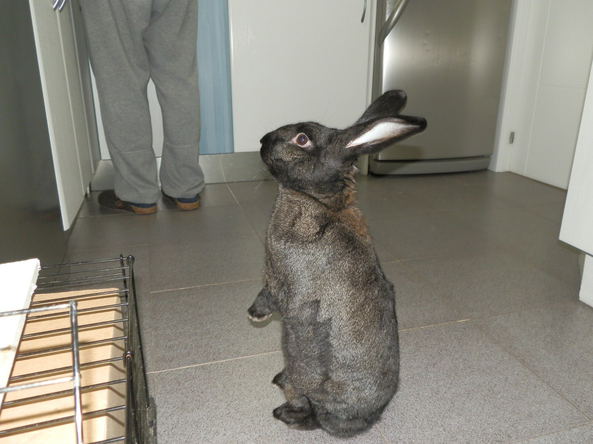

# NoisyGEN


Automated software that allows user to generate icloud hidden mails that are automatically redirected to your main icloud account.  

---

## What is it made for?

iCloud's "Hide My Email" feature lets you create random email addresses. NoisyGEN automates this creation of adresses, so you can generate them in bulk instead of doing it one by one manually.

---

## Requirements 
- Python 3.10 or newer version
- Google chrome installed in your pc
- Active iCloud+ suscription (1€/month), required to use "Hide My Email" feature
- Google chrome language set to Spanish (if not, selectors wont work)

### Install dependencies 

```bash
pip install -r requirements.txt
```

---

## First time running 

1. Run the script
```bash
python main.py
```
2. Enter the number of email addresses you want to generate
3. Login with your icloud account credentials in the chrome window that will open 
>**IMPORTANT:** tick the "Keep me signed in checkbox before submitting the log in"
4. Once logged, do not touch anyhting, the script will take care of the rest and start generating mails
5. A `settings.json` file is created with your session cookies so for future runs, the script skips the login step

---

## Rate limit handling

Apple limits email addresses creation to 5 per hour. This script handles it automatically by:
- Generates mails in rounds of 5
- After each round, the script waits 1 hour and 5 seconds before continuing with the new bunch of mails

---

## Output (mail.csv)

Generated mails are saved into `mail.csv` inside the project folder

## Extra notes

- If you want to force a login into a new account, delete `settings.json` and run the script again. The same happens in case cookies expire